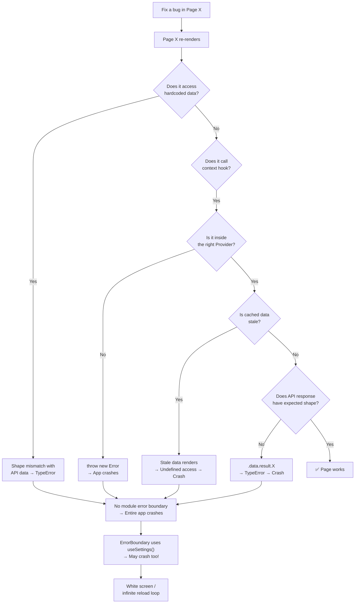

# 🔥 Deep Codebase Crash Analysis — Zeppe Frontend

## Executive Summary

After analyzing **every core file, context, route guard, API layer, page, and shared constant** in the frontend, I've identified **7 systemic root causes** that explain why the app crashes on different pages when you try to fix issues. The crashes are NOT random — they stem from deeply interconnected architectural patterns that create a **domino effect** where fixing one thing breaks another.

---

## ROOT CAUSE #1: The `Home.jsx` Monolith (2,493 lines) — Single Point of Failure

> [!CAUTION]
> **This is the #1 crash source.** `Home.jsx` is a 98KB, 2,493-line monolith that contains **massive amounts of hardcoded static data, inline SVG generators, and tightly coupled rendering logic** all in one file.

### What's hardcoded (lines 82–768):

| Static Data Block | Lines | Description |
|---|---|---|
| `CATEGORY_METADATA` | 88–173 | 8 hardcoded category themes with icons, gradients, banners |
| `ALL_CATEGORY` | 175–189 | Hardcoded "All" category object |
| `CATEGORIES_ANCHOR` | 191–202 | Hardcoded "Categories" anchor object |
| `categories` (local array) | 204–329 | **8 hardcoded categories with full theme objects** — shadows the state variable! |
| `ICON_COMPONENTS` | 332–356 | 23 hardcoded icon-to-component mappings |
| `bestsellerCategories` | 358–418 | 6 hardcoded bestseller sections with Unsplash URLs |
| `MARQUEE_MESSAGES` | 421–425 | 3 hardcoded marquee strings |
| `DRY_FRUITS_DISCOVERY_KEYWORDS` | 427–445 | 16 hardcoded search keywords |
| `SPECIAL_TILE_COLOR_PALETTES` | 447–452 | 4 hardcoded color arrays |
| `MOBILE_SHOWCASE_SECTIONS` | 770–900+ | Hardcoded product showcase with fake prices/discounts |
| `KITCHEN_TOOL_IMAGES` | 661–672 | Hardcoded Wikipedia Commons URLs |
| `DAILY_GROCERY_IMAGES` | 673–684 | 5 hardcoded Unsplash URLs |
| `CEREALS_NUTS_IMAGES` | 685–698 | 6 hardcoded Unsplash URLs |
| `SPECIAL_TILE_IMAGES` | 700–717 | 8 hardcoded Unsplash URLs |
| `SPECIAL_DISCOVERY_TILES` | 719–768 | 8 hardcoded discovery tile objects |

### Why this causes crashes:

1. **Variable shadowing on line 204 vs line 1028**: There's a `const categories = [...]` at module level (line 204) AND a `const [categories, setCategories] = useState(...)` inside the component (line 1028). If any code accidentally references the wrong one, it gets stale hardcoded data instead of API data.

2. **Hardcoded objects have different shapes than API objects**: The static `ALL_CATEGORY` has `{id, _id, name, image, headerVisualKey, headerColor, theme, banner}` but API categories return `{_id, name, slug, type, iconId, image, headerColor}`. Any component that expects one shape and gets the other **will crash with "Cannot read property of undefined"**.

3. **The `MOBILE_SHOWCASE_SECTIONS` (line 770+) contain fake product objects** with properties like `price`, `originalPrice`, `discountText`, `image` — these are NOT real product objects. If any shared component like `ProductCard` tries to access `product._id`, `product.sellerId`, or `product.mainImage` on these, it crashes.

---

## ROOT CAUSE #2: Unsafe Deep Property Access Without Null Guards

> [!WARNING]
> **50+ locations** across the codebase access deeply nested API response properties like `response.data.result.items` without null checks.

### Critical crash-prone patterns found:

```javascript
// ❌ CRASH: If response.data is undefined, or result is undefined
const paymentStatus = response.data.result.status;         // PaymentStatusPage.jsx:34
const payment = response.data.result.payment;               // PaymentStatusPage.jsx:35
window.location.href = response.data.result.redirectUrl;    // OrderDetailPage.jsx:705
const { token, seller } = response.data.result;             // seller/Auth.jsx:324
const { token, delivery } = response.data.result;           // DeliveryAuth.jsx:156
setNotifications(response.data.result.notifications);       // Topbar.jsx:76
const data = response.data.result;                           // seller/Profile.jsx:95
```

### Why this is systemic:

The API pattern in this codebase is `{ success: true, result: {...} }` but:
- Some endpoints return `{ success: true, results: [...] }` (plural)
- Some return `{ success: true, data: {...} }` 
- Some return `{ result: { items: [...] } }`
- Error responses return `{ success: false, message: "..." }` — no `result` at all

**Every page that does `response.data.result.something` without `?.` or a null check will crash when the API returns an error or unexpected shape.**

Found in: `PaymentStatusPage`, `OrderDetailPage`, `CheckoutPage`, `seller/Auth`, `seller/Profile`, `DeliveryAuth`, `DeliveryConfirmation`, `EarningsPage`, `OrderDetails`, `Dashboard` (delivery), `Notifications`, `CodCash`, `Withdrawals`, and more.

---

## ROOT CAUSE #3: Context Hooks That Throw Errors Outside Providers

> [!IMPORTANT]
> **4 context hooks throw runtime errors** if used outside their provider, and the component tree makes this easy to trigger.

| Hook | File | Behavior |
|---|---|---|
| `useAuth()` | AuthContext.jsx:208 | `throw new Error('useAuth must be used within an AuthProvider')` |
| `useSettings()` | SettingsContext.jsx:67 | `throw new Error('useSettings must be used within a SettingsProvider')` |
| `useLocation()` | LocationContext.jsx:337 | `throw new Error('useLocation must be used within a LocationProvider')` |
| `useToast()` | Toast.jsx:39 | `throw new Error('useToast must be used within a ToastProvider')` |

### Why this causes crashes:

- **`RootErrorBoundary` uses `useSettings()`** (line 9) — but `RootErrorBoundary` is used as `errorElement` in the router (AppRouter.jsx:108). Router error elements render **outside** the normal component tree. If the `SettingsProvider` itself crashes, the error boundary that's supposed to catch it **also crashes** because it can't access settings.

- **`LocationProvider` is only wrapped around `CustomerLayoutWrapper`** (AppRouter.jsx:68). Any non-customer page that imports a component using `useLocation()` will crash. The seller, admin, and delivery modules render outside this provider.

- **`WishlistProvider` and `CartProvider` are only in `CustomerLayoutWrapper`** too. Any shared component that calls `useCart()` or `useWishlist()` will crash if rendered outside the customer layout.

### The `useCart()` exception that MASKS the problem:
`useCart()` (CartContext.jsx:21) returns a default value instead of throwing: `useContext(CartContext) ?? defaultCartContextValue`. This means cart operations **silently fail** outside the provider instead of crashing — but then data inconsistencies build up and crash later.

---

## ROOT CAUSE #4: The `useMemo(() => createBrowserRouter(...), [])` Anti-Pattern

> [!WARNING]
> The router is created inside a `useMemo` with an empty dependency array, which means it NEVER re-renders when auth state changes.

[AppRouter.jsx:104](file:///d:/project%20backup/zeppe/frontend/src/core/routes/AppRouter.jsx#L104):
```javascript
const router = useMemo(() => createBrowserRouter([...]), []);
```

### Why this causes crashes:

1. **`createBrowserRouter` is designed to be called once at module level**, not inside a component. Wrapping it in `useMemo` inside a component that uses `useAuth()` creates a contradiction — the router captures stale closures of auth state.

2. **`HomeGate` component** (line 86–92) uses `useAuth()` inside the router tree, but the router itself was memoized with `[]`. When auth state changes (login/logout), the router doesn't recreate, but `HomeGate` re-renders with new auth state, causing potential state conflicts.

3. **All lazy-loaded modules** (`SellerModule`, `AdminModule`, `DeliveryModule`) are loaded inside route definitions that never re-evaluate. If a module fails to load (network error, chunk error), the error is permanent until a full page reload.

---

## ROOT CAUSE #5: Stale Cache + Auth Race Conditions

> [!WARNING]
> The dedupe cache (`dedupe.js`) caches API responses for up to 60 seconds, but auth state changes instantly — creating windows where cached data from the wrong user/role is served.

### The race condition flow:

1. User logs in as **customer** → API responses get cached (cart, profile, categories)
2. User navigates to `/seller/auth` and logs in as **seller**
3. `AuthContext` updates `currentRole` based on URL path
4. Components re-render and call APIs like `/seller/profile`
5. But the dedupe cache **still has the old customer profile cached** under different keys
6. Settings cache (`ttl: 60 * 1000`) serves stale settings for up to 1 minute
7. Components render with mismatched data → crash

### Specific cache TTLs that cause problems:

| API | TTL | Risk |
|---|---|---|
| `/settings` | 60 seconds | Stale theme/config after admin changes |
| `/categories` | 60 seconds | Stale categories after admin edits |
| `/customer/profile` | 5 seconds | Brief but enough for race conditions |
| `/cart` | 2 seconds | Cart state mismatch on rapid actions |

---

## ROOT CAUSE #6: External Image Dependencies as "Constants"

> [!IMPORTANT]
> The codebase has **100+ hardcoded Unsplash/Wikipedia/Flaticon URLs** scattered across "constant" files that will break when these services change URLs or rate-limit.

### Files with external URL dependencies:

| File | URLs | Source |
|---|---|---|
| [categoryImageMap.js](file:///d:/project%20backup/zeppe/frontend/src/shared/constants/categoryImageMap.js) | 40+ | Unsplash |
| [offerSectionOptions.js](file:///d:/project%20backup/zeppe/frontend/src/shared/constants/offerSectionOptions.js) | 7 | Unsplash + Flaticon |
| [Home.jsx](file:///d:/project%20backup/zeppe/frontend/src/modules/customer/pages/Home.jsx) | 50+ | Unsplash + Wikipedia Commons |

### Why this causes crashes:

- **Unsplash URLs with `auto=format&fit=crop` parameters** can return 404 if the photo is deleted or the photographer removes it.
- **Wikipedia Commons URLs** (lines 661–672) are direct file paths that frequently change.
- **`` tags without `onError` handlers** → broken images don't crash React, BUT components that do `product.image || fallbackImage` where the fallback is ALSO an external URL create cascading failures.
- The `getCategoryImage()` function (categoryImageMap.js:63) has a hardcoded Unsplash fallback URL as the last resort — if that specific photo is deleted, **every unmapped category shows a broken image**.

---

## ROOT CAUSE #7: Missing Error Boundaries at Module Level

> [!CAUTION]
> The app has only **2 error boundaries** (one at root, one for routes), but **zero module-level error boundaries**. This means any crash in any component **takes down the entire page**.

### Current error boundary coverage:

```
App.jsx
└── ErrorBoundary (catches ALL errors → shows generic error page)
    └── AuthProvider
        └── SettingsProvider
            └── AppRouter
                └── RootErrorBoundary (route-level only)
                    └── CustomerLayoutWrapper (NO error boundary)
                        └── Home, Checkout, Orders, etc. (NO error boundaries)
                    └── SellerModule (NO error boundary)
                    └── AdminModule (NO error boundary)
                    └── DeliveryModule (NO error boundary)
```

### The domino effect:

1. A single product in the home page has a missing `_id` → `ProductCard` crashes
2. `ProductCard` crash bubbles up through `SectionRenderer` → `Home` → `CustomerLayout` → `CustomerLayoutWrapper`
3. **The entire customer app shows the generic "Something went wrong" error page**
4. User refreshes → same data from cache → same crash → **app appears permanently broken**

### The `RootErrorBoundary` paradox:
[RootErrorBoundary.jsx:9](file:///d:/project%20backup/zeppe/frontend/src/shared/components/RootErrorBoundary.jsx#L9) calls `useSettings()` — if the error was CAUSED by `SettingsProvider` failing, the error boundary itself throws, and the app shows a completely white screen with no recovery option.

---

## Summary: The Interconnected Crash Chain



---

## Priority Fix Recommendations (for when you're ready)

| Priority | Fix | Impact | Effort |
|---|---|---|---|
| 🔴 P0 | Add `?.` optional chaining to ALL `response.data.result.X` patterns (~50 locations) | Prevents most TypeErrors | Low |
| 🔴 P0 | Make `RootErrorBoundary` NOT use `useSettings()` — use hardcoded fallbacks | Prevents white-screen on settings failure | Low |
| 🔴 P0 | Add try/catch or error boundaries around each module (Seller, Admin, Delivery, Customer sections) | Isolates crashes to module level | Medium |
| 🟡 P1 | Extract ALL static data from `Home.jsx` into separate files, ensure shapes match API | Eliminates shape mismatch crashes | Medium |
| 🟡 P1 | Make context hooks return defaults instead of throwing (like `useCart` already does) | Prevents "hook outside provider" crashes | Low |
| 🟡 P1 | Clear dedupe cache on login/logout/role change | Prevents stale cache crashes | Low |
| 🟠 P2 | Replace all external Unsplash/Wikipedia URLs with self-hosted assets or proper CDN | Eliminates external dependency failures | High |
| 🟠 P2 | Break `Home.jsx` (2,493 lines) into smaller composable components | Reduces blast radius of any single crash | High |
| 🟠 P2 | Move `createBrowserRouter` to module level, outside the component | Follows React Router best practices | Medium |

> [!NOTE]
> I have NOT made any changes to the codebase. This is a read-only analysis. Let me know when you want to start implementing fixes — I recommend starting with the P0 items first.
